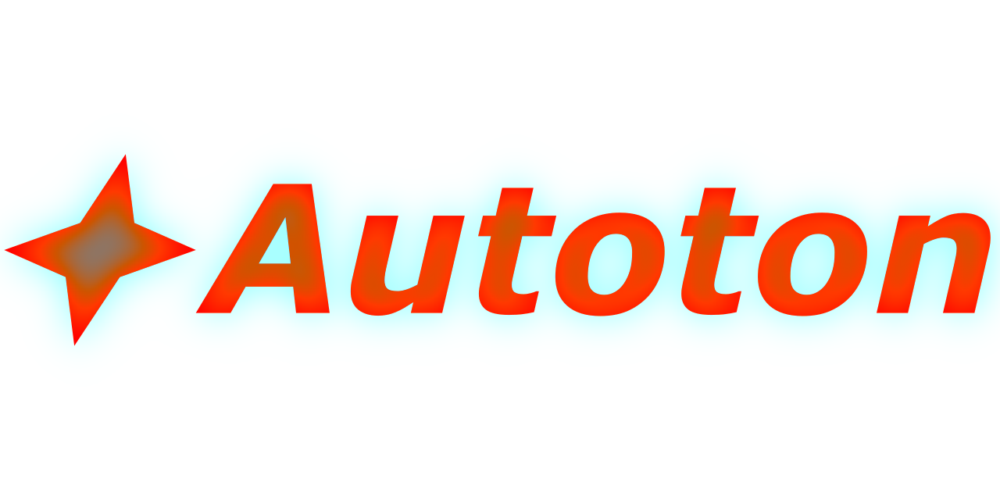

# Autoton

Factory building automation game. Inspired by [Combine & Conquer](https://buckmartin.de), [Mindustry](https://github.com/Anuken/Mindustry)
[GregTech](https://gregtech.overminddl1.com).

> [!WARNING]
> THIS GAME IS STILL IN DEVELOPEMENT.

## Build-it

This game using [Fluid](https://github.com/EndeyshentLabs/fluid) build system

```console
$ ./fluid
```

### Run-it

```console
$ love . # normal mode
$ love . --debug # debug console mode
$ love . --debug-ui # vudu debug UI mode

# After bulding
$ ./build/Autoton.exe # For MS Windows
$ love ./build/Autoton.love # For any other
```

## Dependencies

- [hump](https://github.com/vrld/hump)
- [vudu](https://github.com/deltadaedalus/vudu)
